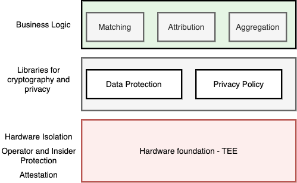
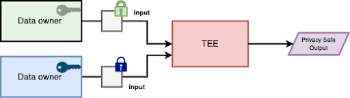
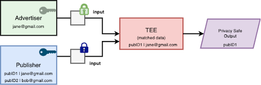
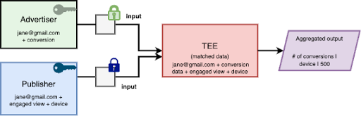
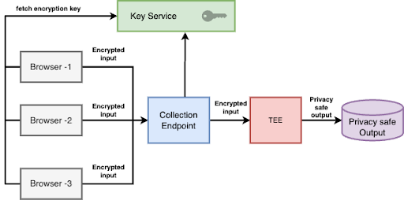
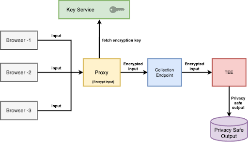

# Reference Architecture for Confidential Data Processing in a Trusted Execution Environment

Authors: Chanda Patel, John Tobler, Quaseer Mujawar

## Introduction

Privacy Enhancing Technologies (PETs) have emerged as a way to provide security and enable helpful, intuitive products while protecting personal information. We have identified an architectural paradigm which tends to address privacy requirements for privacy-centric data management and exchange. We often refer to such solutions as Trusted Execution Environments (TEEs). Our architecture for TEEs tends to address ease of use, cost, scale, reduced implementation complexity, generalizability, and security/privacy goals across numerous use cases. TEE-based solutions (_a mix of software and hardware_) are cited as part of scaled privacy-preserving APIs like the Chrome Privacy Sandbox ([Attribution API](https://github.com/WICG/attribution-reporting-api/blob/main/AGGREGATION_SERVICE_TEE.md#key-terms),  [Protected Audience API](https://github.com/privacysandbox/protected-auction-services-docs/blob/main/trusted_services_overview.md)) and [Microsoft Edge’s forthcoming APIs](https://blogs.windows.com/msedgedev/2024/03/05/new-privacy-preserving-ads-api/). TEEs are starting to be adopted as core PETs per [IAB Tech Lab PETs evolution story](https://iabtechlab.com/privacy-enhancing-technologies-evolution-series-part-1/), [Information Commissioner's Office UK Guidance](https://ico.org.uk/media/for-organisations/uk-gdpr-guidance-and-resources/data-sharing/privacy-enhancing-technologies-1-0.pdf) and the [French Data Protection Authority, CNIL](https://cyber.gouv.fr/produits-certifies/trusted-execution-environment-reference-gpdspe021). The TEE solution space is often vaguely defined, and we seek to bring clarity to our definition. We will outline the components which we have found work best to manifest in a privacy preserving trusted execution environment.

## Understanding TEE-Based Solutions: A Layered Approach

TEE (Trusted Execution Environment) based solutions offer robust security, privacy and transparency for personal data and computations.

They achieve this through a layered architecture:

### Hardware Foundation

*   **Hardware Isolation:** The TEE operates within a physically and logically isolated section of the main processor. This creates a cryptographic barrier between the operations within the TEE and potential threats in the broader system.
*   **Operator and Insider Protection:** TEE’s isolate processing such that even those with administrative privileges to the main system cannot directly access or manipulate the TEE's contents. This safeguards against both external attacks and misuse by privileged users.
*   **Attestation:** The TEE can generate cryptographic proof of its identity and the code it's running. This allows external systems to verify the TEE's identity at runtime. It should be noted that this identity is immutable and tamper proof.

### Data Protection

*   **Encryption/Decryption:** Data entering or leaving the TEE is encrypted, ensuring its confidentiality outside the protected environment. Within the TEE, the data can be decrypted but is isolated and protected from anyone per the protections outlined above.
*   **Attestation-Based Key Management:** Decrypting data relies on attestation and policy evaluation. If the TEE's code or configuration isn't as expected per participant controlled policy, decryption keys are withheld which prevents unauthorized access.
*   **Online Attestation:** Attestation offers a critical security layer for clients who need to communicate confidentially with a TEE. By establishing the TEE’s identity via cryptographic attestation, clients can independently validate the code and configuration the TEE runs on. This validation process ensures the TEE is genuine and secure, allowing for trustworthy data exchange.

### Privacy Policy

A privacy-preserving trusted execution environment requires a robust security architecture and technically enforced privacy policy. Solutions will vary per use case and are commonly implemented using k-anonymity, noise, or differential privacy. Some considerations are:

*   **Differential Privacy** \
Statistical techniques can be applied to introduce noise into data results. This makes it difficult or impossible to re-identify individuals within datasets, enhancing privacy while maintaining data utility. It should be noted that any budget managed outside the TEE additionally needs privacy and security considerations. The [Chrome Attribution API](https://github.com/WICG/attribution-reporting-api/blob/main/AGGREGATION_SERVICE_TEE.md#key-terms) uses a distributed administrative strategy to better ensure the integrity of the budget.

*   **K-Anonymity** \
Data is generalized or grouped so that individuals cannot be singled out from at least 'K-1' other similar entries. This protects against privacy breaches through correlation. This may be suitable for more rigid APIs where usage is controlled.

### Business Logic

The TEE houses the core application code. Common use cases may be:

*   **Matching Algorithms:** Finding correspondences or relationships within datasets.
*   **Attribution:** Linking effects or events back to their likely causes.
*   **Aggregation:** Calculating summaries or statistics from the raw data.

## Architectural Abstractions

The building blocks for a TEE based system can be composed to meet the needed security and privacy requirements across a variety of participant and administrative paradigms. We will outline some common configurations below.

Roles in a secure distributed system

*   **Data owner:** Possesses and controls personal data.
*   **TEE operator:**  Manages the Trusted Execution Environment (TEE) system.
*   **Coordinator:** Ensures code integrity through open-source audits and binary hash verification. Oversees the deployment of key services across the global cloud infrastructure.

Stakeholders may take on multiple roles, depending on the specific use case and requirements.

### Design Paradigm 1 - Data Exchange Between Two (or more) Parties

In a common case of data analysis, two data owners want to join their data sets to gain additional insights. In order to securely process and join their data sets, the data owners can use the TEE design primitives.

Each data owner ensures that their data is secure in their data sources. Via additional setup, the owners will ensure that the clear text data is only accessible within a TEE running specific processing code. This can be accomplished multiple ways as different clouds provide different levels of support and features. A common pattern is for data owners to encrypt the data on their end and configure the encryption keys in a Key Management Service (KMS) to only allow TEE with specific processing code to allow the decryption. The TEE is only capable of decrypting data after successful attestation verification, authentication, and authorization. For Google Cloud Platform (GCP), data owners can push their data to Google storage and configure a policy on storage to only allow access to a TEE with specific processing code.

The TEE system can be operated by a third party or a data owner, but neither has access to the actual data processing, ensuring privacy. The privacy-protected output can optionally be shared with the TEE operator or sent to another designated recipient besides the original data owner.

In this model, each data owner owns the encryption keys used for encrypting the data. The operator of TEE does not have access to the decryption keys or the processing and thus it can be managed by either party or an independent 3rd party.

#### Example 1 -  Data Minimization Example

A common use case is data minimization. A good example of this is when an advertiser wants to retarget a user on a particular publisher domain. Assuming all consents are granted, the advertiser wants to serve ads to a specific set of users with known email addresses. The advertiser would like to share this list without the publisher seeing unmatched PII and potentially learning PII otherwise unknown to them. In this case, the advertiser would provide an encrypted list of &lt;email> and the publisher would provide an encrypted list of &lt;publisherID>&lt;email> for processing. The join would happen in the TEE and the output would be the matched publisherIDs. Both parties can be assured their PII was not seen by the other party and that only the intersection of their sets is output from the system.

#### Example 2 - Data Aggregation

Another common use case is the generation of aggregate insights. A good example of this is when an advertiser wants to understand the interaction rate (engaged views) of their preferred customers over a particular ad campaign. With appropriate consents collected, the advertiser would provide an encrypted list of their preferred customers in the form of &lt;email>. The publisher would provide an encrypted list of ad events served including view times and device types keyed by email address. In the TEE, these datasets would be decrypted and joined to produce aggregate sets of advertiser preferred customer engaged views by device type. In this case, no personally identifiable information leaves the trusted environment.

In the simple case, aggregates can be generated using k-anonymity. In some cases, this is insufficient to protect personal information and differentially private noise may be needed. It should be noted that privacy budgeting needs are susceptible to attack if managed by a single data owner. We recommend the budgeting system be administered and reconciled across multiple parties to avoid these risks with a single administrator. This architecture is encapsulated in the Coordinator Model outlined below.

### Design Paradigm 2 - Coordinator Model

There is another design paradigm where key management and privacy policies can be delegated to 3rd parties (e.g, coordinators). In the 2-party (or more) exchange outline above, the parties are distributing the trust and ensuring processing occurs as intended. In the coordinator model, that responsibility is offloaded to 2 (or more) 3rd parties.

In such a model, key and budget management is split between multiple parties. User data is encrypted with keys owned and operated by coordinators. The data can be encrypted in browsers, devices or by data owners themselves using the public keys hosted by coordinators.

The decryption keys needed to decrypt the data are split into multiple shares. These shares are distributed to different coordinators in a way that no single party can reconstruct the full key.

Similarly, coordinators may also manage differential privacy budgets. As mentioned above, a single data owner managing the budget can manipulate budgets to either starve or incorrectly grant additional budget. To prevent such an attack, the budget can be mirrored between 2 parties. In such a case, no single party can make changes to the budget without detection.

#### Example - Streaming Data Collection

For datasets managed offline, the 2-party exchange works well. Both parties have an opportunity to prepare data with encryption keys and call APIs routing data to the trusted environments. For browser collected events, this may not be the case. Javascript tags are often used to dynamically collect and transfer data to a data collection endpoint. A tagged advertising site does not give the advertiser a chance to encrypt the data prior to data transfer. For such a use case, there are two configurations using coordinators to inject trust and reliability into the system.

##### Browser/Device Encryption

In this example, the tag is calling a coordinator maintained key service to encrypt data before sending it to the data collection endpoint. Trust is anchored in the coordinators and validation that the tag is taking this action prior to sending the data.

##### Customer-Owned Proxy Encryption

In this example, the data flows from the tag to a customer owned collection proxy before being encrypted and sent to the collection endpoint. In this customer-owned environment, data may be additionally transformed and minimized before encrypting with keys from the coordinator owned key service. This proxy could optionally be run within a TEE if the administrator is not trustworthy.

In both cases, the coordinator is responsible for ensuring the key services are available and the keys are valid in the trusted environment. We prefer such a model for streaming use cases as even a temporary configuration issue may result in large scale data gaps.

### Conclusion

Privacy preserving technologies are becoming essential for privacy-centric data management and exchange. We believe TEEs built on a foundation of trusted microservices and [confidential compute](https://en.wikipedia.org/wiki/Confidential_computing) primitives can be generalized to meet the needs of disparate use cases. We will continue to invest in such technology to advance trust and transparency across the ads ecosystem.

## Appendix A. Glossary

**Privacy Enhancing Technology (PET)**

Privacy-enhancing technologies (PETs) are technologies that provide data security and privacy assurances.

**Trusted Execution Environment (TEE)**

TEE based solutions offer robust security, privacy and transparency for personal data and computations. This can be achieved via hardware isolation, operators/insider protection and cryptographic attestation at runtime.

**Confidential Compute**

Confidential Computing refers specifically to TEEs that use hardware to enforce isolation and guarantees.

**Differential Privacy**

Statistical techniques can be applied to introduce noise into data results. This makes it difficult to re-identify individuals within datasets, enhancing privacy while maintaining data utility.

**K-Anonymity** \
Data is generalized or grouped so that individuals cannot be singled out from at least 'K-1' other similar entries. This protects against privacy breaches through correlation.

**Coordinator**

An administrator for trusted execution environments including key management, budgeting, and/or server processing.
